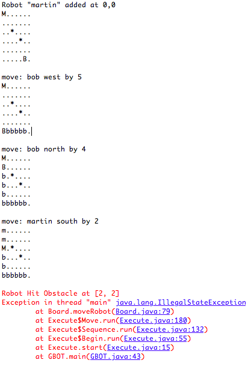

Java Intepreter
===

## Details
This was a class programming project in which we wrote a programming language
interpreter for a made up language called GBOT. The language is as specified
below.

Statement | Meaning
--- | ---
begin *i j stmts* halt | program definition - defines height *i* and width *j* of the room
obstacle *a b*; | draw obstacle at position (a,b)
robot *v a b*; | draw a robot with name *v* at position *(a,b)*
add *a* to *v*; | add statement
move *v d a*; | move the robot *v*, *a* spaces in direction *d*
*v* = *a*; | an assignment statement
do *stmts* until *a* > *b*; | Execute *stmts*, if *a* > *b* then repeat

The project had three parts.

1. Make a scanner to parse the program for valid keywords such as "begin" or "robot". The scanner would create the symbol table from these keywords.
2. Make the parser to generate the
rules to check if the syntax was correct according to the rules of the
langauage. It was also the parser's job to recognize any comments. 
3. Create the syntax tree of the program to actually
execute the code.

## Screenshot

